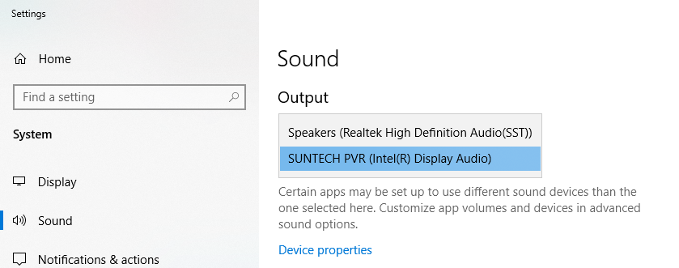
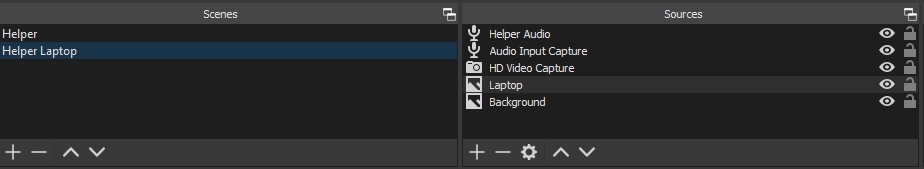

# Remote Assist Teaching
Imagine leading an engineering class with a hands on view of tooling, material and technologies. Or to walk a set of technicians through a repair in real time with hands on view and 3D annotations. Or leading to an introduction to chemistry and having the ability for the instructor to explore atomic structures hands on in the physical space with the students seeing it directly.

All of this is possible with 100% off the self technology, a pinch of practice, and a dash of imagination.

So if we've peaked your interest, we've put together a couple guides and videos to get you started. Please check them out below!

## See it in action
### Behind the Scenes
TODO: youtube vid

### Inside the meeting
TODO: youtube vid

## BOM
- HD Video Capture: https://www.amazon.com/Capture-Broadcast-Streaming-Grabber-Converter/dp/B0779ZJZX3
- OBS Studio (Open Broadcaster Software, free and open source): https://obsproject.com/
- Sample scene resources: [download this folder](/obs)

## Setup

### Presenter
1. HoloLens with Remote Assist installed
2. PC configured so that it acts as a "Miracast" receiver
3. Confirm that the HoloLens will connect and share its display with the PC: https://docs.microsoft.com/en-us/hololens/holographic-photos-and-videos (Go to the section "Streaming video with Miracast)
4. Teams installed
5. Team meeting schedule with the audience invited (This will be the meeting that guests/students attend to watch the presenter and helpers session)
6. If you plan to use Holograms or other content like webpages, drawings etc, place those in the space in which you plan to present. (This prestaging and its critical to ensure you have a good experience)

### Helper/Assistant
#### DEMOLAP
1. Set the audio output for `DEMOLAP` to your HD Video Capture device so that OBS can pull in the audio from the Remote Assist meeting (Windows Settings > System > Sound)

2. Have reference materials ready to go on `DEMOLAP`
	- TODO: These are the materials that will help the "presenter" solve their problem or in the case of a teaching scenario re-enforce the content being presented (see the sample videos above) 

#### PRODLAP
1. The OBS Projection monitor, connected to `PRODLAP`, resolution should be set to 1920x1080
2. Download the [sample scene resources](/obs)
3. Install OBS on `PRODLAP`
	- Import the downloaded [sample Scene Collection](/obs/SceneCollection-Remote_Assist.json)
	- Switch to the *Remote Assist* Scene Collection
	
	

	- Update the sources accordingly:

	

	`Helper Audio` - your capture device's audio

	`Audio Input Capture` - `PRODLAP` default audio

	`HD Video Capture` - your capture device

	`Laptop` - SUR20_Laptop... image from *obs* folder

	`Background` - Legendary-HoloLens... image from *obs* folder

## Demo
### Presenter
1. Start Teams on the `PRODLAP`
2. Join the meeting on the `PRODLAP` - Do this well in advance of the actual start time of the meeting (15 mins is a good start as it allows you to ensure things are connected and working)
3. Begin streaming the HoloLens video to the `PRODLAP` using Miracast
4. Share the `PRODLAP` screen in the Teams meeting 
5. Start the Remote Assist from inside HoloLens calling the "Helper"
6. Begin your demonstration. 

### Alternative Presenter
You could also create the "Presenter" view using the documentation for setting up the "Helper" device `DEMOLAP`. In this case you'd need 2 laptops. One to host the HoloLens Miracast stream and the other to host the Teams meeting. You would then use the HD Video Capture plug in to stream the HoloLens experience on to the `PRODLAP`.  
	
### Helper/Assistant
1. Start Microsoft Teams on `DEMOLAP`
2. Plug in HD Video Capture to `DEMOLAP` and `PRODLAP`
3. Start OBS on `PRODLAP`
	- Select the Helper scene
	- Right-click on the scene display -> Fullscreen Projector (Preview) -> [your external monitor]
4. Start Microsoft Teams on `PRODLAP`
5. Join the Customer Teams Meeting ON `PRODLAP`
	- Share [your external monitor] screen in the Teams Meeting
6. Accept call from Presenter on `DEMOLAP`
7. Annotate in Remote Assist on `DEMOLAP` (see sample videos above)
8. Upload file (that you prepared above) in Remote Assist on `DEMOLAP`

# Contributing

This project welcomes contributions and suggestions.  Most contributions require you to agree to a
Contributor License Agreement (CLA) declaring that you have the right to, and actually do, grant us
the rights to use your contribution. For details, visit https://cla.opensource.microsoft.com.

When you submit a pull request, a CLA bot will automatically determine whether you need to provide
a CLA and decorate the PR appropriately (e.g., status check, comment). Simply follow the instructions
provided by the bot. You will only need to do this once across all repos using our CLA.

This project has adopted the [Microsoft Open Source Code of Conduct](https://opensource.microsoft.com/codeofconduct/).
For more information see the [Code of Conduct FAQ](https://opensource.microsoft.com/codeofconduct/faq/) or
contact [opencode@microsoft.com](mailto:opencode@microsoft.com) with any additional questions or comments.

# Legal Notices

Microsoft and any contributors grant you a license to the Microsoft documentation and other content
in this repository under the [Creative Commons Attribution 4.0 International Public License](https://creativecommons.org/licenses/by/4.0/legalcode),
see the [LICENSE](LICENSE) file, and grant you a license to any code in the repository under the [MIT License](https://opensource.org/licenses/MIT), see the
[LICENSE-CODE](LICENSE-CODE) file.

Microsoft, Windows, Microsoft Azure and/or other Microsoft products and services referenced in the documentation
may be either trademarks or registered trademarks of Microsoft in the United States and/or other countries.
The licenses for this project do not grant you rights to use any Microsoft names, logos, or trademarks.
Microsoft's general trademark guidelines can be found at http://go.microsoft.com/fwlink/?LinkID=254653.

Privacy information can be found at https://privacy.microsoft.com/en-us/

Microsoft and any contributors reserve all other rights, whether under their respective copyrights, patents,
or trademarks, whether by implication, estoppel or otherwise.